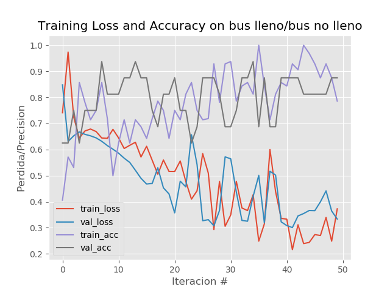
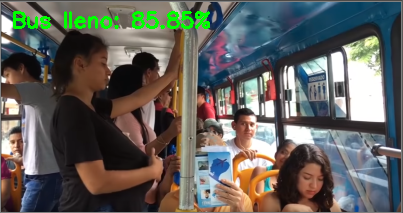
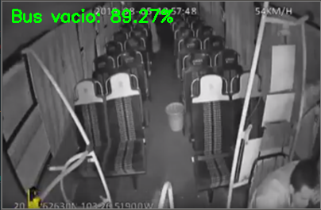

# Red neural bajo la arquitectura de LeNeT

## Índice
* [Instalación](#instalacin)
* [Entrenamiento de la red neural convolucional](#entrenamiento-de-la-red-neural-convolucional)
* [Probar red neural](#probar-la-red-neural)
* [Extras: Recolectador de imagenes](#extras-recolectar-imagenes)
* [Créditos](#crditos)

## Instalación
Para la instalacion del ambiente se necesita tener instalado python en su version 3.6.1
puesto que tensorflow por el momento no soporta la última version de python que es la 3.7

1. Descargar [Python 3.6.1](https://www.python.org/downloads/release/python-361/)
2. Una vez descargado e instalado se recomienda crear un entorno virtual, puede ser con
    [anaconda](https://www.anaconda.com/distribution/) o con [virtualenv](https://virtualenv.pypa.io/en/latest/installation/).
    
3. Dentro del directorio del proyecto se ejecuta el siguiente comando:
    ```shell script
     $ pip install -r requirements.txt
    ```
## Entrenamiento de la red neural convolucional
Para entrenar la red neural se ejecuta el script "entrenar_red.py" con los siguigientes argumentos

| Parámetro | Descripción |
|----|---|
| -d  | nombre de la carpeta donde esta el dataset |
| -p  | nombre del grafico en donde se mostraran los resultados del entrenamiento |
| -m | nombre de la red neural que se entrenara y se guardara en el disco|

### Ejemplo:
```shell script
     $ python entrenar_red.py -m redNeural.h5 -d downloads -p resultados.png
```
Grafica de resultados: 




## Probar la red neural:
Ejecutar el siguiente script especificando el nombre de la red neural y la ruta de la imagen que 
queremos predecir:
```shell script
     $ python prueba_red.py -m redNeural.h5 -i imagenes-pruebas/lleno.PNG
```

Tendremos como salida la imagen etiquetada en base a la prediccion de la red neural:


```shell script
     $ python prueba_red.py -m redNeural.h5 -i imagenes-pruebas/vacio3.PNG
```

   

## Extras: Recolectar imagenes
Para recolectar imagenes para el dataset se lo hizo con la libreria de [google-images-download](https://github.com/hardikvasa/google-images-download)
En donde los argumentos de configuracion se pueden hacer bien desde un archivo .json o desde el
script mismo:
```python
   arguments = {"keywords": "bus vacio, bus lleno", "limit": 10, "print_urls": False}
```
Solamente basta con ejecutar el script y automaticamente se creara una carpeta que por defecto
se llamara "downloads" y dentro de ella se descargaran en sus respectivas carpetas las imagenes
en base a los "keywords" definidos anteriormente.

````shell script
    $ python recolector_imagenes.py
````


## Créditos:
Todo el material del proyecto fue referenciado del trabajo del Doctor [Adrian Rosebrock](https://github.com/jrosebr1)
a través del tutorial [Image classification with Keras and deep learning](https://www.pyimagesearch.com/2017/12/11/image-classification-with-keras-and-deep-learning/)
